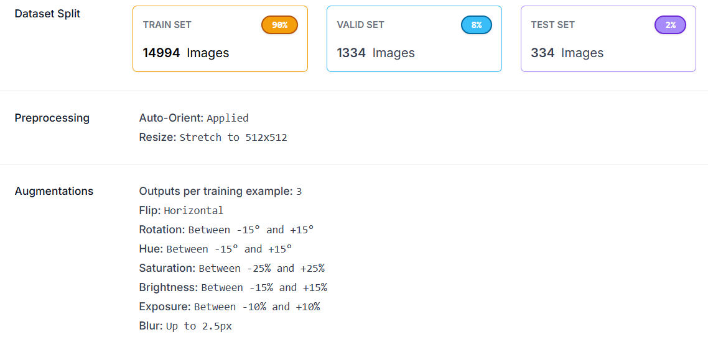

# 🌿 Plant Leaf Disease Detection & Treatment System

An AI-powered web application that detects plant leaf diseases using YOLOv11 object detection and provides personalized treatment recommendations through an intelligent chatbot powered by Google's Gemini.


## 📋 Table of Contents
- [Features](#-features)
- [Tech Stack](#-tech-stack)
- [Dataset](#-dataset)
- [Model Training](#-model-training)
- [Installation](#-installation)
- [Usage](#-usage)
- [Project Structure](#-project-structure)
- [Configuration](#-configuration)
- [Acknowledgments](#-acknowledgments)
- [License](#-license)
- [Author](#-author)

## ✨ Features

- 🔍 **Real-time Disease Detection**: Upload leaf images and get instant disease identification using YOLOv11
- 🤖 **AI Treatment Assistant**: Chat with an intelligent bot for personalized medication and treatment advice
- 📊 **Visual Results**: View annotated images with bounding boxes highlighting affected areas
- 💬 **Conversational Interface**: Natural language interaction for treatment recommendations
- 🎨 **Modern UI**: Clean, responsive design with gradient backgrounds and smooth animations
- ⚡ **Fast Processing**: Optimized YOLOv11 model for quick detection and response times
- 🔄 **Context-Aware Chat**: Maintains conversation history for follow-up questions

## 🛠 Tech Stack

### Backend
| Technology | Purpose |
|------------|---------|
| **Flask** | Web framework & REST API |
| **Ultralytics YOLOv11** | Object detection model |
| **Google Gemini 2.0 Flash** | Conversational AI chatbot |
| **Pillow** | Image processing |
| **Flask-CORS** | Cross-origin resource sharing |
| **python-dotenv** | Environment variable management |

### Frontend
| Technology | Purpose |
|------------|---------|
| **HTML5** | Page structure |
| **CSS3** | Styling, gradients, animations |
| **Vanilla JavaScript** | Client-side logic & API calls |
| **Fetch API** | Asynchronous HTTP requests |

### AI/ML
| Technology | Purpose |
|------------|---------|
| **YOLOv11** | Real-time disease detection |
| **Gemini 2.0 Flash** | Natural language processing |
| **Roboflow** | Dataset management & augmentation |
| **Google Colab** | Model training environment |

## 📊 Dataset

### Original Dataset
This project uses the **PlantDoc Dataset** by Chainfly as the base dataset:

🔗 **Original Dataset**: [PlantDoc Dataset by Chainfly](https://universe.roboflow.com/chainfly-kbwvw/plantdoc-rcmou)

### Custom Augmented Dataset
I created a custom augmented version of the dataset on Roboflow with various transformations to improve model performance:

🔗 **Augmented Dataset**: [Augmented Dataset v1 by Jyot](https://app.roboflow.com/workspace1-qu3qq/plantdoc-rcmou-z1s3f/1)

### Augmentation & Preprocessing Details

The following preprocessing and augmentations were applied to enhance the training data:



These augmentations help the model generalize better to real-world conditions like different lighting, angles, and image quality.

## 🧠 Model Training

The YOLOv11 model was trained on Google Colab using the augmented dataset from Roboflow.

### Pre-trained Model
A pre-trained model (`best.pt`) is already included in this repository at `backend/assets/best.pt`. You can use it directly without training.

### Train Your Own Model (Optional)

If you want to train your own model or improve upon the existing one:

#### Training Notebook
All training code is available in [`trainPlantDocToYOLO.ipynb`](trainPlantDocToYOLO.ipynb)

#### Steps to Train

1. **Open the Colab Notebook**
   - Upload `trainPlantDocToYOLO.ipynb` to Google Colab
   - Or open directly from this repository

2. **Get Roboflow API Key**
   - Go to [my Roboflow dataset](https://app.roboflow.com/workspace1-qu3qq/plantdoc-rcmou-z1s3f/1)
   - Click on 'Download dataset'
   - Create an account or sign in
   - Choose YOLOv11 format and choose 'Show download code'
   - Continue and copy your API key

3. **Configure the Notebook**
   ```python
   # Replace with your Roboflow API key
   rf = Roboflow(api_key="your_roboflow_api_key")
   ```

4. **Run All Cells (in a GPU environment)**
   - The notebook will download the dataset
   - Train the YOLOv11 model
   - Predict the test images and print the metrics

5. **Download the Model**
   - After training, download `best.pt` from `/content/runs/detect/train/weights/best.pt`

## 📦 Installation

### Prerequisites
- Python 3.8 or higher
- Google Gemini API key ([Get one here](https://makersuite.google.com/app/apikey))

### Step 1: Clone the Repository
```bash
git clone https://github.com/Jyot-Shah/Plant-Leaf-Disease-Detection.git
cd Plant-Leaf-Disease-Detection
```

### Step 2: Install Dependencies
```bash
pip install -r requirements.txt
```

### Step 3: Configure Environment Variables
Create a `.env` file in the root directory:
```env
GEMINI_API_KEY=your_gemini_api_key_here
```

### Step 4: Model Setup
You have two options:

**Option A: Use Pre-trained Model (Recommended)**
- The pre-trained model is already included at `backend/assets/best.pt`
- No additional setup required

**Option B: Train Your Own Model**
- Follow the [Model Training](#-model-training) section above
- Place your trained `best.pt` in `backend/assets/`

### Step 5: Run the Application
```bash
cd backend
python app.py
```
Backend runs on `http://127.0.0.1:5000`

### Step 6: Open Frontend
Open `frontend/index.html` in browser or use Live Server extension in VS Code.

## 🚀 Usage

### Disease Detection Flow
```
┌─────────────────┐     ┌─────────────────┐     ┌─────────────────┐
│  Upload Image   │ ──▶ │  YOLO Detection │ ──▶ │  Display Result │
└─────────────────┘     └─────────────────┘     └─────────────────┘
                                                        │
                                                        ▼
┌─────────────────┐     ┌─────────────────┐     ┌─────────────────┐
│  Get Treatment  │ ◀── │  Gemini AI Chat │ ◀── │  Init Chatbot   │
└─────────────────┘     └─────────────────┘     └─────────────────┘
```

### Steps
1. **Upload Image**: Select a leaf image (JPG, PNG)
2. **Analyze**: Click "Analyze Image" button
3. **View Results**: See annotated image + disease badge
4. **Chat**: Ask questions about treatment & prevention

## 📁 Project Structure

```
Plant-Leaf-Disease-Detection/
│
├── backend/
│   ├── app.py                    # Flask app & API routes
│   │   ├── /predict_json         # Disease detection endpoint
│   │   └── /chat                 # Chatbot endpoint
│   │
│   ├── chatbot.py                # Gemini AI integration
│   │   ├── initialize_chat()     # Start chat session with disease context
│   │   └── chat_with_gpt()       # Send messages & get responses
│   │
│   └── assets/
│       └── best.pt              # Pre-trained YOLOv11 model weights
│
├── frontend/
│   ├── index.html               # Main HTML structure
│   │   ├── Header section
│   │   ├── Upload card
│   │   ├── Result card
│   │   └── Chatbot card
│   │
│   ├── style.css                # Styling
│   │   ├── Green gradient theme
│   │   ├── Card animations
│   │   ├── Loading spinner
│   │   └── Chat message bubbles
│   │
│   └── app.js                   # Client-side logic
│       ├── Form submission handler
│       ├── API calls (fetch)
│       └── Chat message handling
│
├── requirements.txt             # Python dependencies
├── trainPlantDocToYOLO.ipynb    # Colab training notebook
├── dataset-info.png             # Augmentation details image
├── .env                         # Environment variables (create this)
└── README.md                    # Documentation
```

## ⚙️ Configuration

### Chatbot System Prompt
Customize AI behavior in `backend/chatbot.py` if you want to:
```python
SYSTEM_PROMPT = """You are a concise plant pathology assistant..."""
```

## 🙏 Acknowledgments

This project was inspired by and built upon tutorials from the [Augmented AI](https://www.youtube.com/@Augmented_AI) YouTube channel. Their videos provided valuable guidance on implementing plant disease detection systems.

## 📝 License

This project is licensed under the MIT License - see the [LICENSE](LICENSE) file for details.

## 👤 Author

**[Jyot Shah](https://www.linkedin.com/in/jyotshah1/)**

For questions or issues, please open an issue on GitHub or mail to **jyotshah1595@gmail.com**.

---

<p align="center">
  Made with 💚 for plant health
</p>